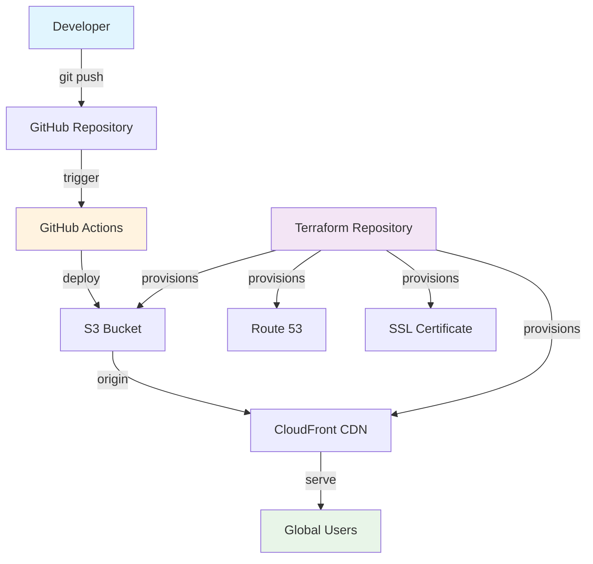

# AWS Static Site Deployment Guide

[](https://github.com/TanyaMushonga/aws-static-site-deploy/actions/workflows/deploy.yml)
[](https://aws.amazon.com/)
[](https://github.com/TanyaMushonga/terraform-s3_and_cloudfront)
[](https://developer.mozilla.org/en-US/docs/Web/HTML)

> A comprehensive, production-ready guide for deploying static websites on AWS using S3 and CloudFront, complete with automated CI/CD pipeline and Infrastructure as Code.

## What This Project Demonstrates

This repository showcases a complete **modern cloud deployment workflow** featuring:

- **Comprehensive Documentation** - Detailed step-by-step deployment guide
- **Infrastructure as Code** - Terraform-managed AWS resources
- **Automated Deployment** - GitHub Actions CI/CD pipeline
- **Global CDN Distribution** - CloudFront for worldwide performance
- **Production Security** - SSL/TLS certificates and secure configurations
- **Cost-Optimized** - Efficient resource usage and caching strategies

---

## Infrastructure Architecture



## Live Deployment

This static site is **deployed live on AWS** and demonstrates:

- **S3 Static Website Hosting** - Scalable, serverless hosting
- **CloudFront CDN** - Global edge locations for fast content delivery
- **Custom Error Pages** - Professional 404/403 error handling
- **Automated Deployments** - Zero-downtime CI/CD pipeline
- **Infrastructure Automation** - Terraform-managed resources

### Infrastructure Provisioning

The AWS infrastructure for this project is fully automated using **Terraform**:

**[terraform-s3_and_cloudfront](https://github.com/TanyaMushonga/terraform-s3_and_cloudfront)**

This companion repository provisions:

- **S3 Bucket** with static website hosting configuration
- **CloudFront Distribution** with global edge locations
- **SSL/TLS Certificate** via AWS Certificate Manager
- **Security Policies** and access controls
- **Monitoring & Logging** setup

---

## Project Structure

```
aws-static-site-deploy/
├── index.html              # Main documentation page
├── error.html               # Custom 404/error page
├── README.md               # This comprehensive guide
├── .github/
│   └── workflows/
│       └── deploy.yml      # Automated deployment pipeline
└── docs/                      # Additional documentation
```

## What You'll Learn

### Complete AWS Deployment Guide

- Step-by-step S3 bucket configuration
- CloudFront distribution setup
- Custom domain and SSL configuration
- Performance optimization techniques
- Security best practices

### DevOps Best Practices

- Infrastructure as Code with Terraform
- CI/CD pipeline with GitHub Actions
- Automated testing and deployment
- Monitoring and error handling

### Professional Web Development

- Responsive HTML5 design
- Modern CSS styling techniques
- Progressive enhancement
- Accessibility considerations

---

## Quick Start

### 1. Infrastructure Setup

First, provision the AWS infrastructure using Terraform:

```bash
# Clone the infrastructure repository
git clone https://github.com/TanyaMushonga/terraform-s3_and_cloudfront.git
cd terraform-s3_and_cloudfront

# Initialize and apply Terraform
terraform init
terraform plan
terraform apply
```

### 2. Deploy the Website

Clone this repository and set up the deployment:

```bash
# Clone this repository
git clone https://github.com/TanyaMushonga/aws-static-site-deploy.git
cd aws-static-site-deploy

# Configure GitHub Secrets (in repository settings)
AWS_ACCESS_KEY_ID=your_access_key
AWS_SECRET_ACCESS_KEY=your_secret_key
AWS_DEFAULT_REGION=us-east-1
S3_BUCKET=your-bucket-name
CLOUDFRONT_DISTRIBUTION_ID=your-distribution-id
```

### 3. Automatic Deployment

Simply push to the main branch to trigger automatic deployment:

```bash
git add .
git commit -m "Update website content"
git push origin main
```

The GitHub Actions workflow will automatically:

- Deploy HTML files to S3
- Invalidate CloudFront cache
- Ensure zero-downtime deployment

---

## Technology Stack

| Component           | Technology              | Purpose                         |
| ------------------- | ----------------------- | ------------------------------- |
| **Frontend**        | HTML5, CSS3, JavaScript | Static website content          |
| **Hosting**         | AWS S3                  | Scalable static website hosting |
| **CDN**             | AWS CloudFront          | Global content delivery         |
| **DNS**             | AWS Route 53            | Domain management               |
| **SSL**             | AWS Certificate Manager | HTTPS encryption                |
| **Infrastructure**  | Terraform               | Infrastructure as Code          |
| **CI/CD**           | GitHub Actions          | Automated deployment            |
| **Version Control** | Git/GitHub              | Source code management          |

---

## Features Showcase

### Professional Design

- Modern, responsive layout
- AWS branding and color scheme
- Mobile-first design approach
- Accessibility compliant

### Advanced Functionality

- Interactive troubleshooting guides
- Copy-paste AWS CLI commands
- Real-time deployment status
- Comprehensive error handling

### Performance Optimized

- Optimized images and assets
- Minified CSS and JavaScript
- CloudFront caching strategies
- Fast global content delivery

### Security Focused

- HTTPS enforcement
- Security headers implementation
- Access control policies
- Vulnerability best practices

---

## Deployment Pipeline

Our automated deployment process ensures:

1. **Code Quality** - Automated checks and validation
2. **Fast Deployment** - Only HTML files are synced
3. **Global Distribution** - CloudFront cache invalidation
4. **Monitoring** - Real-time deployment status
5. **Zero Downtime** - Seamless content updates

---

## Use Cases

This project is perfect for:

- **Documentation Sites** - Technical guides and tutorials
- **Company Websites** - Corporate landing pages
- **Portfolio Sites** - Professional portfolios
- **Marketing Pages** - Product landing pages
- **Blogs** - Static blog sites
- **Educational Content** - Learning resources

---

## Contributing

We welcome contributions! Here's how you can help:

1. **Fork the repository**
2. **Create a feature branch** (`git checkout -b feature/amazing-feature`)
3. **Commit your changes** (`git commit -m 'Add amazing feature'`)
4. **Push to the branch** (`git push origin feature/amazing-feature`)
5. **Open a Pull Request**

---

## Related Resources

### Infrastructure Repository

- **[terraform-s3_and_cloudfront](https://github.com/TanyaMushonga/terraform-s3_and_cloudfront)** - Complete Terraform infrastructure code

### Documentation & Guides

- [AWS S3 Static Website Hosting](https://docs.aws.amazon.com/s3/latest/userguide/WebsiteHosting.html)
- [AWS CloudFront Developer Guide](https://docs.aws.amazon.com/cloudfront/latest/DeveloperGuide/)
- [Terraform AWS Provider](https://registry.terraform.io/providers/hashicorp/aws/latest/docs)
- [GitHub Actions Documentation](https://docs.github.com/en/actions)

### Tools & Services

- [AWS CLI](https://aws.amazon.com/cli/)
- [Terraform](https://www.terraform.io/)
- [GitHub Actions](https://github.com/features/actions)

---

## License

This project is licensed under the MIT License - see the [LICENSE](LICENSE) file for details.

---

## Author

**Tanya Mushonga**

- GitHub: [@TanyaMushonga](https://github.com/TanyaMushonga)
- LinkedIn: [Connect with me](https://www.linkedin.com/in/tanyaradzwa-t-mushonga-b23745209/)
- Portfolio: [tanyaradzwatmushonga.me](https://tanyaradzwatmushonga.me)

---

## Acknowledgments

- AWS for providing excellent cloud infrastructure
- Terraform for Infrastructure as Code capabilities
- GitHub for hosting and CI/CD platform
- The open-source community for inspiration and best practices

---

<div align="center">

**Star this repository if you found it helpful!**

[](https://github.com/TanyaMushonga/aws-static-site-deploy/stargazers)
[](https://github.com/TanyaMushonga/aws-static-site-deploy/network/members)

_Built with ❤️ for the developer community_

</div>
