# 🚀 AWS Static Site Deployment Guide

[](https://github.com/TanyaMushonga/aws-static-site-deploy/actions/workflows/deploy.yml)
[](https://aws.amazon.com/)
[](https://github.com/TanyaMushonga/terraform-s3_and_cloudfront)
[](https://developer.mozilla.org/en-US/docs/Web/HTML)

> A comprehensive, production-ready guide for deploying static websites on AWS using S3 and CloudFront, complete with automated CI/CD pipeline and Infrastructure as Code.

## 🎯 **What This Project Demonstrates**

This repository showcases a complete **modern cloud deployment workflow** featuring:

- 📚 **Comprehensive Documentation** - Detailed step-by-step deployment guide
- 🏗️ **Infrastructure as Code** - Terraform-managed AWS resources
- 🔄 **Automated Deployment** - GitHub Actions CI/CD pipeline
- 🌍 **Global CDN Distribution** - CloudFront for worldwide performance
- 🔒 **Production Security** - SSL/TLS certificates and secure configurations
- 💰 **Cost-Optimized** - Efficient resource usage and caching strategies

---

## 🏗️ **Infrastructure Architecture**

```mermaid
graph TB
    A[👨‍💻 Developer] -->|git push| B[GitHub Repository]
    B -->|trigger| C[GitHub Actions]
    C -->|deploy| D[S3 Bucket]
    D -->|origin| E[CloudFront CDN]
    E -->|serve| F[🌍 Global Users]

    G[Terraform Repository] -->|provisions| D
    G -->|provisions| E
    G -->|provisions| H[Route 53]
    G -->|provisions| I[SSL Certificate]

    style A fill:#e1f5fe
    style F fill:#e8f5e8
    style G fill:#f3e5f5
    style C fill:#fff3e0
```



## 🚀 **Live Deployment**

This static site is **deployed live on AWS** and demonstrates:

- ✅ **S3 Static Website Hosting** - Scalable, serverless hosting
- ✅ **CloudFront CDN** - Global edge locations for fast content delivery
- ✅ **Custom Error Pages** - Professional 404/403 error handling
- ✅ **Automated Deployments** - Zero-downtime CI/CD pipeline
- ✅ **Infrastructure Automation** - Terraform-managed resources

### 🏗️ **Infrastructure Provisioning**

The AWS infrastructure for this project is fully automated using **Terraform**:

🔗 **[terraform-s3_and_cloudfront](https://github.com/TanyaMushonga/terraform-s3_and_cloudfront)**

This companion repository provisions:

- 🪣 **S3 Bucket** with static website hosting configuration
- 🌐 **CloudFront Distribution** with global edge locations
- 🔒 **SSL/TLS Certificate** via AWS Certificate Manager
- 🛡️ **Security Policies** and access controls
- 📊 **Monitoring & Logging** setup

---

## 📁 **Project Structure**

```
aws-static-site-deploy/
├── 📄 index.html              # Main documentation page
├── 📄 error.html               # Custom 404/error page
├── 📋 README.md               # This comprehensive guide
├── .github/
│   └── workflows/
│       └── 🚀 deploy.yml      # Automated deployment pipeline
└── docs/                      # Additional documentation
```

## 🎯 **What You'll Learn**

### 📚 **Complete AWS Deployment Guide**

- Step-by-step S3 bucket configuration
- CloudFront distribution setup
- Custom domain and SSL configuration
- Performance optimization techniques
- Security best practices

### 🔧 **DevOps Best Practices**

- Infrastructure as Code with Terraform
- CI/CD pipeline with GitHub Actions
- Automated testing and deployment
- Monitoring and error handling

### 💡 **Professional Web Development**

- Responsive HTML5 design
- Modern CSS styling techniques
- Progressive enhancement
- Accessibility considerations

---

## 🚀 **Quick Start**

### 1️⃣ **Infrastructure Setup**

First, provision the AWS infrastructure using Terraform:

```bash
# Clone the infrastructure repository
git clone https://github.com/TanyaMushonga/terraform-s3_and_cloudfront.git
cd terraform-s3_and_cloudfront

# Initialize and apply Terraform
terraform init
terraform plan
terraform apply
```

### 2️⃣ **Deploy the Website**

Clone this repository and set up the deployment:

```bash
# Clone this repository
git clone https://github.com/TanyaMushonga/aws-static-site-deploy.git
cd aws-static-site-deploy

# Configure GitHub Secrets (in repository settings)
AWS_ACCESS_KEY_ID=your_access_key
AWS_SECRET_ACCESS_KEY=your_secret_key
AWS_DEFAULT_REGION=us-east-1
S3_BUCKET=your-bucket-name
CLOUDFRONT_DISTRIBUTION_ID=your-distribution-id
```

### 3️⃣ **Automatic Deployment**

Simply push to the main branch to trigger automatic deployment:

```bash
git add .
git commit -m "Update website content"
git push origin main
```

The GitHub Actions workflow will automatically:

- ✅ Deploy HTML files to S3
- ✅ Invalidate CloudFront cache
- ✅ Ensure zero-downtime deployment

---

## 🛠️ **Technology Stack**

| Component           | Technology              | Purpose                         |
| ------------------- | ----------------------- | ------------------------------- |
| **Frontend**        | HTML5, CSS3, JavaScript | Static website content          |
| **Hosting**         | AWS S3                  | Scalable static website hosting |
| **CDN**             | AWS CloudFront          | Global content delivery         |
| **DNS**             | AWS Route 53            | Domain management               |
| **SSL**             | AWS Certificate Manager | HTTPS encryption                |
| **Infrastructure**  | Terraform               | Infrastructure as Code          |
| **CI/CD**           | GitHub Actions          | Automated deployment            |
| **Version Control** | Git/GitHub              | Source code management          |

---

## 📊 **Features Showcase**

### 🎨 **Professional Design**

- Modern, responsive layout
- AWS branding and color scheme
- Mobile-first design approach
- Accessibility compliant

### 🔧 **Advanced Functionality**

- Interactive troubleshooting guides
- Copy-paste AWS CLI commands
- Real-time deployment status
- Comprehensive error handling

### 🚀 **Performance Optimized**

- Optimized images and assets
- Minified CSS and JavaScript
- CloudFront caching strategies
- Fast global content delivery

### 🔒 **Security Focused**

- HTTPS enforcement
- Security headers implementation
- Access control policies
- Vulnerability best practices

---

## 📈 **Deployment Pipeline**

Our automated deployment process ensures:

1. **🔍 Code Quality** - Automated checks and validation
2. **🚀 Fast Deployment** - Only HTML files are synced
3. **🌐 Global Distribution** - CloudFront cache invalidation
4. **📊 Monitoring** - Real-time deployment status
5. **🔄 Zero Downtime** - Seamless content updates

---

## 🎯 **Use Cases**

This project is perfect for:

- 📚 **Documentation Sites** - Technical guides and tutorials
- 🏢 **Company Websites** - Corporate landing pages
- 📊 **Portfolio Sites** - Professional portfolios
- 🛒 **Marketing Pages** - Product landing pages
- 📖 **Blogs** - Static blog sites
- 🎓 **Educational Content** - Learning resources

---

## 🤝 **Contributing**

We welcome contributions! Here's how you can help:

1. 🍴 **Fork the repository**
2. 🌿 **Create a feature branch** (`git checkout -b feature/amazing-feature`)
3. ✅ **Commit your changes** (`git commit -m 'Add amazing feature'`)
4. 📤 **Push to the branch** (`git push origin feature/amazing-feature`)
5. 🔄 **Open a Pull Request**

---

## 📚 **Related Resources**

### 🏗️ **Infrastructure Repository**

- **[terraform-s3_and_cloudfront](https://github.com/TanyaMushonga/terraform-s3_and_cloudfront)** - Complete Terraform infrastructure code

### 📖 **Documentation & Guides**

- [AWS S3 Static Website Hosting](https://docs.aws.amazon.com/s3/latest/userguide/WebsiteHosting.html)
- [AWS CloudFront Developer Guide](https://docs.aws.amazon.com/cloudfront/latest/DeveloperGuide/)
- [Terraform AWS Provider](https://registry.terraform.io/providers/hashicorp/aws/latest/docs)
- [GitHub Actions Documentation](https://docs.github.com/en/actions)

### 🛠️ **Tools & Services**

- [AWS CLI](https://aws.amazon.com/cli/)
- [Terraform](https://www.terraform.io/)
- [GitHub Actions](https://github.com/features/actions)

---

## 📄 **License**

This project is licensed under the MIT License - see the [LICENSE](LICENSE) file for details.

---

## 👥 **Author**

**Tanya Mushonga**

- 🐙 GitHub: [@TanyaMushonga](https://github.com/TanyaMushonga)
- 💼 LinkedIn: [Connect with me](https://linkedin.com/in/tanyamushonga)
- 🌐 Portfolio: [tanyamushonga.dev](https://tanyamushonga.dev)

---

## 🙏 **Acknowledgments**

- AWS for providing excellent cloud infrastructure
- Terraform for Infrastructure as Code capabilities
- GitHub for hosting and CI/CD platform
- The open-source community for inspiration and best practices

---

<div align="center">

**⭐ Star this repository if you found it helpful!**

[](https://github.com/TanyaMushonga/aws-static-site-deploy/stargazers)
[](https://github.com/TanyaMushonga/aws-static-site-deploy/network/members)

_Built with ❤️ for the developer community_

</div>
